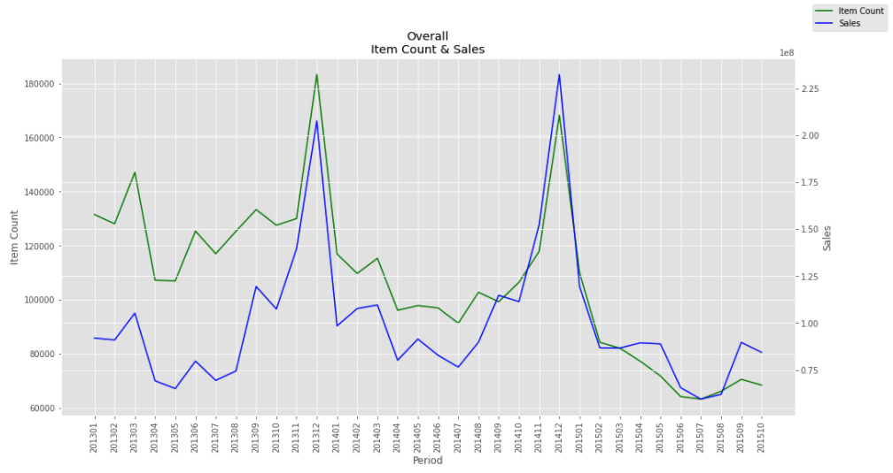
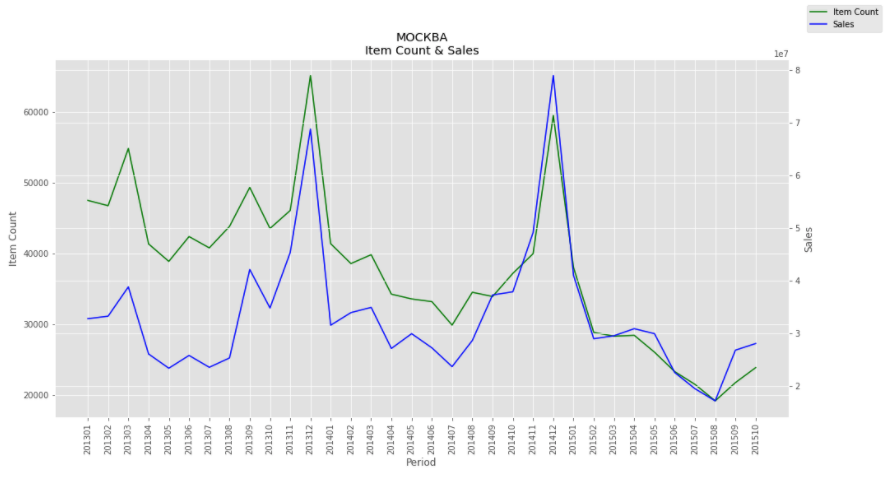
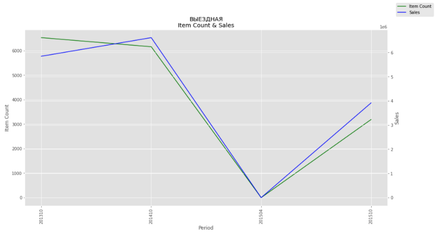
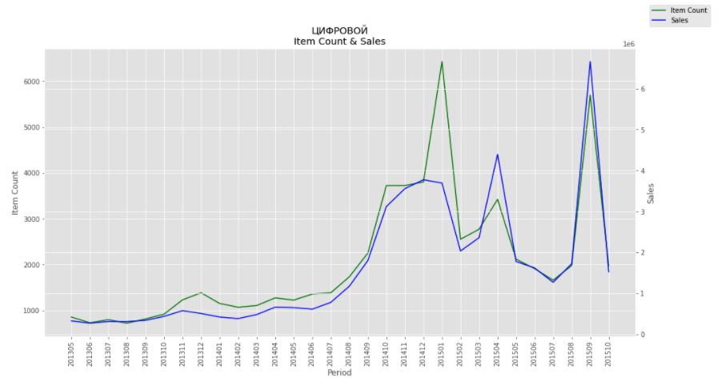
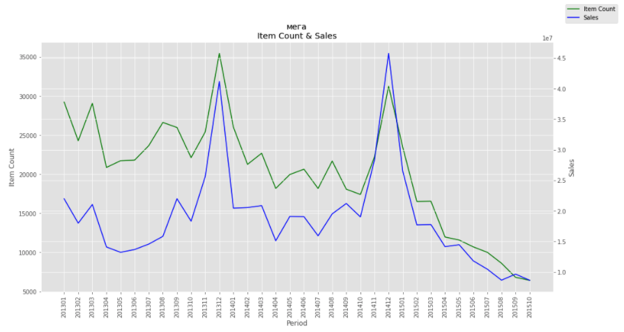
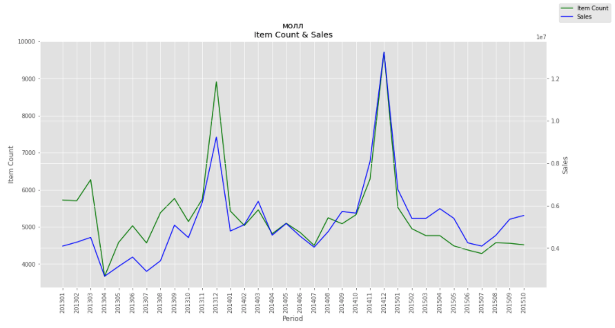

## Overview
LSTM Model for predicting sales for the Kaggle Predict Future Sales Kudos Competition.

---

The code in this repo represents an attempt to predict sales using a Long Short-Term Memory (LSTM) model from the Kaggle kudos competition [Predict Future Sales](https://www.kaggle.com/c/competitive-data-science-predict-future-sales/overview).

---

## Raw Data
The data provided for this competition can be retrieved [here](https://www.kaggle.com/c/competitive-data-science-predict-future-sales/data) and is a sample of 3 years worth of sales - 2013 to 2015 - from the Russian software firm 1C Company. Shop, item, and category names were provided in Russian with very few English words provided for some of item descriptions.

Directory ```data``` was added to ```PROJECT_HOME``` for the raw files.

---

## Modules
Module ```sales_data``` contains the ```SalesData``` class that merges the sales, item, and category information into Pandas dataframes. Two key objects that are instantiated from this class are ```SalesData.daily_sales``` and ```SalesData.monthly_sales``` to facilitate EDA of the datasets.

Module ```nlp``` implements traditional natural language processing techniques, such as tokenization and CountVecorizer, to break out categorical data from the shop names in hopes of leveraging it. The Russian language was left intact, but peripheral analysis of the names revealed words such as "Mega" and "Mall", as well as the city names in which the shops are located.

Module ```lstm``` contains the ```ModelInput``` class - which prepares the data - and the ```LSTMModel``` class - which builds and trains the LSTM model to ultimately make the predictions.


---

## EDA
The task is to predict sales for Nov 2015 at the shop/item level based on the data from the two previous years. In order to get a feel of the available data, natural language processing techniques were used to break out categorical info from the shops - such as city names and shop types. Then, some initial Exploratory Data Analysis was conducted on the data aggregated at different levels.

When looking at all shops, all items, we see the expected holiday spikes in November and December. Interestingly, item counts show a steady decline but sales dollars are relatively flat, indicating, perhaps, a rise in prices.



These trends were similarly reflected at the city level. Here's Moscow, which carries about 1/3 of the total volume:



Also within the data was something that translated as "OUTGOING". Not sure what this represents, but only 4 months of data are represented by this location. My guess is that it is a seasonal thing.



"DIGITAL" - what I assume to be internet sales - shows a significant ramp up starting in July 2014. 



"Mega" shops show a similar decline in item counts, but "Mall" shops seemed to hold steady with a slight rise in sales dollars.




